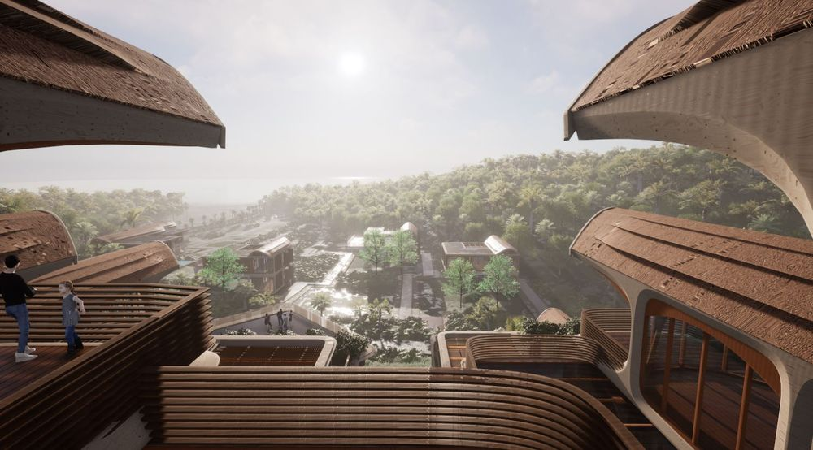

# How to Start a New Country
 
This post is a review of Balaji S. Srinivasan's post at [1729.com](https://1729.com/how-to-start-a-new-country/)

The necessity of starting a new country is fundamental to innovation and jurisdiction often puts limitations on what can be done in practice. Prior to the 17th century, the first corporations were not-for-profit, these included universities and hospitals, as they were public goods. It was not imaginable to form a company in that time, after the 17th century it was possible to do so, mostly by European imperialists looking to control trade, resources and territory in Asia and Africa. Right now it is not easy to imagine forming a nation, however with the cloud it is clear that in the forseable future we will be in place to form a country.  

There is already a great interest in [community](https://www.communityled.com/) and technology founders are starting to build their products around community instead of platforms. 

# The Four Places To Build

The internet can expand the possibilies of ownership in the metaverse. There are no limits on the expanse. We started the internet by uploading the atoms into bits, now is time to reverse that taking the bits and creating spaces and communities in the real world

| Frontier |    Metric     |Denizens|
|----------|:-------------:|------:|
| Earth    |    population | 7.7B |
| Water    |    crew ships | 2M |
| Space    |   outer space | 7 |
| Internet | online users  | 3.5B |

> "Still, once we remember that Facebook has 3B users, Twitter has 300M, and many individual influencers have more than 1M followers,it starts to be not too crazy to imagine we can build a 1-10M person social network with a genuine sense of national consciousness -- Balaji .S Srinivasan

Some of the numbers are variable, check [space](https://www.howmanypeopleareinspacerightnow.com/) for auto-updates. 

  This account is ever-interesting when you think of the 6 degrees of separation  
    <a href="#fn-also" class="footnote-ref">1</a>
   . 
  Social media sites usually have less than 6 steps of social distance,  for example LinkedIn always shows your 1st and 2nd degree connections with people. On Twitter the separation is 4.67, around 50% people on Twitter are 4 steps away from each  other, almost everyone is less than 5 steps away.  In the real world it takes more steps to connect with people than in the online world. Balaji refers to this new ansemble and social networks meshing together to form a <code>network state</code>, we can digitally sew these disjoint enclaves together into a new kind of polity, a network state.

# How to Start a New Country

Balaji has proposed 6 methods to build a country, the first 3 conventional ones are usually based on violence or can lead to violence. The others are not tested at scale, but inhibit violence. 

### 1. Elections

The election process like the <code>electoral college</code> system in the US provides a fortified method against cabal, faction and corruption.  Since it has existed since the `1780s` , it is a conventional way to build a country.  but it can work in different ways that can help the. 

### 2. Revolution &  War

This approach is violent and is therefore not advised.  
  The aim is "spreading individual freedom while preventing cataclysmic mimetic
    <a href="#fn-vio" class="footnote-ref">3</a>
     
 violence"   <a href="https://perell.com/essay/peter-thiel/">Peter Thiel</a>

Some example of this recently, 2006 is the [Afrikaners](https://en.wikipedia.org/wiki/Suidlanders) in South Africa who have been preparing for a hypothetical "revolution risk" of 50%. They have even succeded in building states where only Afrikaners reside, like [Orania](https://en.wikipedia.org/wiki/Orania,_Northern_Cape), a whites-only town for self-determination of Afrikaners in South Africa, either on federal principles or as a fully independent Boer homeland.
 

### 4. Micronations

Micronations is a political entity whose members are an independent nation or sovereign state. Some other forms of micronations experiments include [Charter Cities](https://www.chartercitiesinstitute.org/).

 
The Vatican is one example of a city state, an enclave within Rome, which is a theocracy. Swaziland 

    <a href="#fn-swazi" class="footnote-ref">2</a>
 is a landlocked country in Southern Africa, it is a monarchy, another example of tribal state. East Timor (Timor Leste) is another example of a micronation inside Indonesia that relequinshed control over the territory. It became the first soveriegn state  of the 21st century and ASEAN member aspirant. 

### 5. Seasteading
Seasteads are dwellings that are at seas, they can be made from cruise ships, and floating islands.  The Seasteading Institute, is founded by Wayne Gramlich and Patri Friedman who are working on making this feasible. 

#### 5.1 [Artificial Islands](https://en.wikipedia.org/wiki/Artificial_island)
Man-made islands are usually government projects for geopolitics, the island are constructed by people rather than formed by natural means. China has made at least seven artificial islands in the South China Sea totaling 2000 acres.

<iframe width="1065" height="608" src="https://www.youtube.com/embed/luTPMHC7zHY" title="YouTube video player" frameborder="0" allow="accelerometer; autoplay; clipboard-write; encrypted-media; gyroscope; picture-in-picture" allowfullscreen></iframe>

### 6. Space
Perhaps the most prestigious of the start-a-new-country paths is the idea of colonizing other planets. Unlike seasteading or micronations, space exploration started at the government level and has been glamorized in many movies and TV shows, so it enjoys a higher degree of social acceptability. People mainly think of it as currently technically infeasible rather than outright crazy. Elon Musk's SpaceX is one entity seriously contemplating the logistics of starting a new state on Mars.

### 7. Cloud Countries

These are nations created from the cloud and recruiting happens in the cloud and then later assume them in the physical world. These are created trough virtual social or interest networks which can eventually be countries. Countries like Finland are begining to offer relocation packages, such recruiting can translate to cloud city member harvesting. 

> VR is timeless, since you could interact with spaces that where created in the past. You can have infinite space and land in virtual reality, because the design of the world is not necessarily newtownian. 

[Decentraland](https://decentraland.org/) : is a platform where you could own digital real-estate and assets. This community can then later be assimilated in the real world. 

[Próspera](https://www.bloomberg.com/news/articles/2021-03-27/prospera-in-honduras-a-private-tech-city-now-open-for-business) : a mini startup nation with its own set of laws has begun recruiting residents in 2021.

 
 

  

  <ol>
    <li id="fn-also">
      
 The idea that all people on average are six, or fewer, social connections away from each other.

      <a href="#fnref-also" class="footnote-backref">↩</a>
    </li>
    <li id="fn-swazi">
      
The Kingdom of Eswatini aka Swaziland, is a landlocked country in Southern Africa. 

      <a href="#fnref-thing" class="footnote-backref">↩</a>
    </li>
    <li id="fn-vio">
      
      <a href="#fnref-vio" class="footnote-backref">↩ Peter Thiel & Eric Weinstein </a>
    </li>
      <li id="fn-vio">
      
      <a href="#fnref-vio" class="footnote-backref">↩ Balaji on cloud cities, decentralized credentials and pseudonymity </a>
      <iframe width="80%" height="90%" src="https://www.youtube.com/embed/eim8REOYLzA" title="Balaji on Everything" frameborder="0" allow="accelerometer; autoplay; clipboard-write; encrypted-media; gyroscope; picture-in-picture" allowfullscreen></iframe>
    </li>
  </ol>

